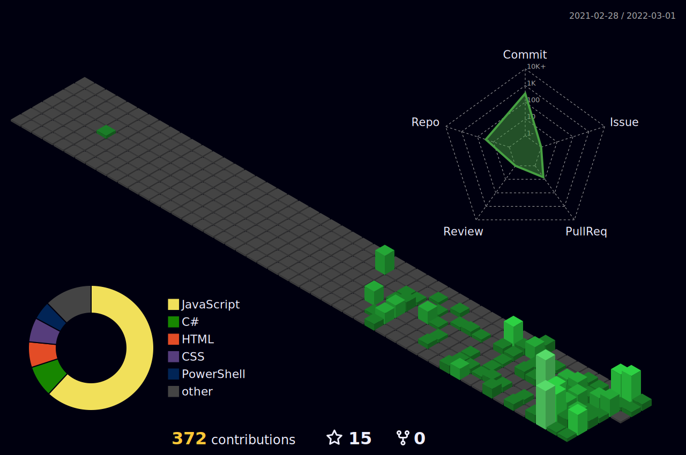

<!-- <p align="center">
	
</p> -->
<br>
<h1 align="center">Welcome to my profile 👋</h1>
<hr>

[](/blob/master/LICENSE)
[](https://www.javascript.com)
[](/pulls)

[](https://github.com/Mark-Gutenberger/mark-gutenberger/actions/workflows/codeql-analysis.yml)

<!--START_SECTION:waka-->


**🐱 My GitHub Data** 

> 🏆 76 Contributions in the Year 2022
 > 
> 📦 314.3 kB Used in GitHub's Storage 
 > 
> 💼 Opted to Hire
 > 
> 📜 21 Public Repositories 
 > 
> 🔑 2 Private Repositories  
 > 
**I Mostly Code in HTML** 

```text
HTML                     5 repos             ████████░░░░░░░░░░░░░░░░░   33.33% 
JavaScript               3 repos             █████░░░░░░░░░░░░░░░░░░░░   20.0% 
TypeScript               3 repos             █████░░░░░░░░░░░░░░░░░░░░   20.0% 
CMake                    1 repo              █░░░░░░░░░░░░░░░░░░░░░░░░   6.67% 
Dart                     1 repo              █░░░░░░░░░░░░░░░░░░░░░░░░   6.67%

```


**Timeline**

 


 Last Updated on 03/02/2022 12:10:03 UTC
<!--END_SECTION:waka-->

<center>
	<center>
		<table>
			<center>
				<tr>
					<center>
						<td>
							<center></center>
							<br />
							<br />
							<center></center>
						</td>
					</center>
					<center>
						<td>
							<center></center>
						</td>
					</center>
				</tr>
			</center>
		</table>
	</center>
	<center>
		<table>
			<center>
				<tr>
					<center>
						<td>
							<center></center>
						</td>
					</center>
				</tr>
			</center>
		</table>
	</center>

</center>

